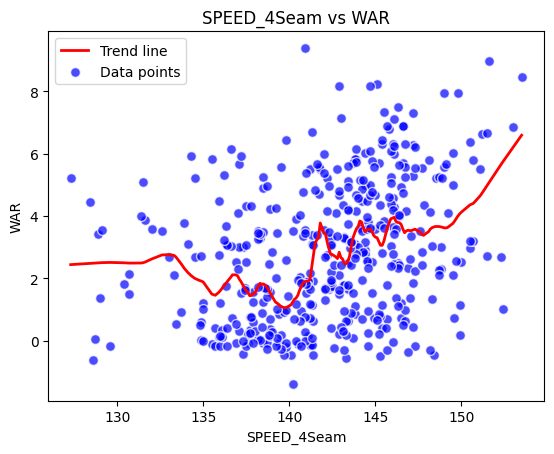
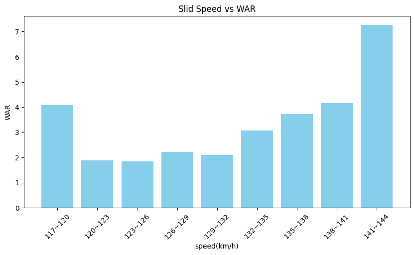
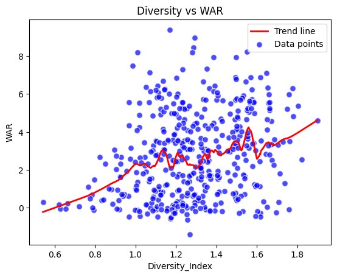

# Pitch-Perfomance

## 프로젝트 개요
본 프로젝트는 야구 투수들의 다양한 성능 지표를 분석하여 투수들의 전략적 가치와 효율성을 평가합니다. 주요 분석 내용으로는 투구 유형별 성능, 투구 속도별 분석, 그리고 투구 전략의 다양성을 포함합니다.

## 프로젝트 구조
### Step 1: Crawling
- 웹에서 투수 데이터를 수집합니다. 특히, 선수들의 경기 기록과 통계를 크롤링하는 코드가 포함되어 있습니다.

### Step 2: 4-Seam Fastball Analysis
- 4-Seam 패스트볼 투구에 대한 성능 분석을 수행합니다. 해당 데이터를 기반으로 투수별 효율성을 비교하고 그래프로 시각화합니다.
---
- 
---
### Step 3: Speed Analysis
- 투구 속도를 분석하여 투수의 속도별 성능을 평가합니다. 속도 구간별 성능 데이터를 집계하고 이를 그래프로 나타내어 속도가 성능에 미치는 영향을 분석합니다.
---
- 
---
### Step 4: Diversity Analysis
- 투수가 사용하는 투구 유형의 다양성을 지수화하여 분석합니다. 다양성 지수와 승리 기여도(WAR)를 비교하여 전략적 다양성이 성능에 미치는 영향을 평가합니다.
---
- -
---
## 설치 방법
프로젝트를 시작하기 전에 Python 및 필요한 라이브러리를 설치해야 합니다.

```bash
# 저장소 복제
git clone https://github.com/20161609/PitchPerfomance.git
```

## 사용 방법
프로젝트의 각 주피터 노트북은 다음과 같은 방법으로 실행할 수 있습니다:

1. **Step1_crawling.ipynb** - 데이터 수집을 위해 가장 먼저 실행해야 합니다.
2. **Step2_4seam.ipynb** - 특정 투구에 대한 분석을 수행하고 시각화합니다.
3. **Step3_speed.ipynb** - 투구 속도별 성능을 분석합니다.
4. **Step4_diversity.ipynb** - 다양성 지수를 계산하고, 그 영향을 분석합니다.

노트북 실행 예제:

```bash
jupyter notebook [노트북-이름.ipynb]
```

## 기여하기
프로젝트에 기여하고 싶은 개발자는 저장소를 포크하고, 변경 사항을 반영한 후 풀 리퀘스트를 제출해 주세요.
